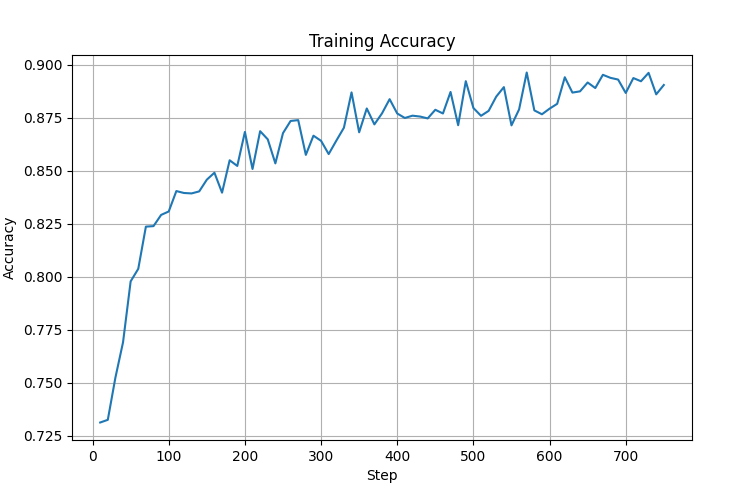
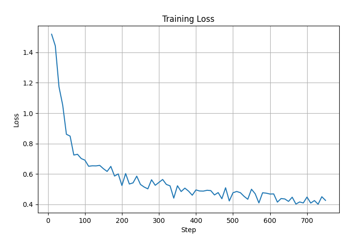
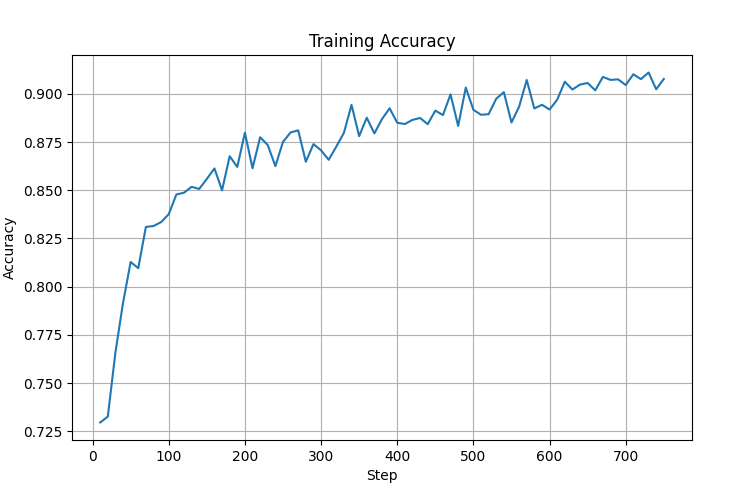
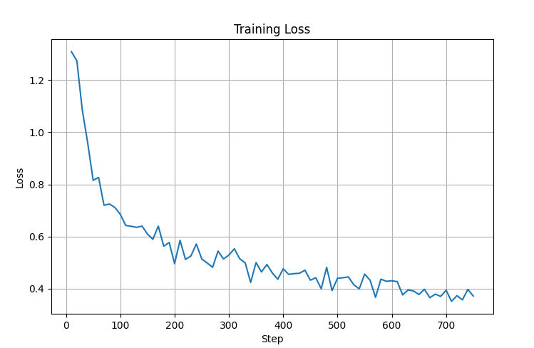

**Chatbot-Q&A-agent**

# 🌟 **Introduction**
This project consists of two main path:

### Fine-tuning Llama 3 and Qwen2.5
Fine-tune Llama 3 and Qwen2.5 language models to improve Function Calling capabilities using the xLAM dataset and QLoRA.

### Chatbot Agent
Develop an Multi agent in **langgraphwith** and supervisor workflow  include **RE_Retriever**, **Researcher**, **ScraperWeb** and **Coder**

## Results demo:

<video src="image/demo.mp4" controls width="800"></video>


### Hardware Requirements (Fine tune):

GPU: 16GB+ VRAM (24GB recommended for larger models)<br>
RAM: 32GB+ system memory<br>
Storage: 50GB+ free space for models and datasets<br>

**Project Structure**
Q&A-agent

```bash
project/
├── agent_system/
│   ├── tools/
│   │   ├── Search.py
│   │   ├── code_Interpreter.py
│   │   ├── code_multilang.py
│   │   └── process.....
│   │
│   ├── agent/
│   │   ├── model_Finetune.py
│   │   ├── supervisor.py         #agent system
│   │   ├── system_prompts.py
│   │
│   ├── rag/
│   │   ├── __init__.py
│   │   ├── embeding.py          
│   │   └── retriever.py         
│
├── Fine_tune/
│   ├── Configs/
│   │   └── FT_config.py         # configure of model and training
│   │
│   ├── Scripts/
│   │   ├── __init__.py
│   │   ├── prepare_data.py      # create, format-load and process xLam dataset
│   │   ├── merge_adapter.py     # configure tokenizer, QLoRA-enable model and create LoRA for PEFT
│   │   ├── setup_.py            # setup hardware
│   │   └── training.py          # training QLoRA with SFTTrainer
│   │
│   └── inference/
│       └── model_loading_interface.py
│                                    # load and test model after training
│
├── configs/
│   └── agent_config/
│       └── FT_config.py         # configure of model and training
│
├── data/
│   ├── combinedata/             # combine GAIA data 
│
├── evaluation/
│   └── eval_benchmark.py
│
├── app.py
├── SFTtrainer.py
├── docker_compose.py
├── requirement.txt
├── README.md                    # we are here
└── Dockerfile                   

```

## FineTune:
### Model fine tune:
 Scripts will Fine tune Meta-Llama-3-8B-Instruct and Qwen2.5-7B-Instruct to improve Function Calling capabilities using the [xLAM dataset](https://huggingface.co/datasets/Salesforce/xlam-function-calling-60k) and QLoRA.


## Fine-tuning Results on xLAM Dataset

| Model | Accuracy | Loss |
|--------|-----------|-------|
| Qwen2.5-7B-Instruct |  |  |
| Meta-Llama-3-8B-Instruct |  |  |

### Observations
- Both models show a consistent decrease in training loss during fine-tuning.
- Accuracy improves steadily throughout training.
- Qwen2.5-7B and Llama-3-8B demonstrate stable convergence behavior on the xLAM dataset.


Model Fine tune of project was save in here: [Model Card for Qwen2_5_7B_Instruct_xLAM](https://huggingface.co/gugukaka/Qwen2.5-7B-Instruct-xLAM) and [Model Card for Meta_Llama_3_8B_Instruct_xLAM](https://huggingface.co/gugukaka/Meta-Llama3-8B-Instruct-xLAM)

See how to use to [Finetune](IF_YOU_WANT_FINE_TUNE:).


# Agent system

A multi-agent chatbot system combining Retrieval-Augmented Generation (RAG), ReAct reasoning, reranking, and fine-tuned Large Language Models on the xLAM dataset.

---

## Features

- Multi-agent workflow using LangGraph
- ReAct-based reasoning and action loop
- Retrieval-Augmented Generation (RAG)
- FAISS vector database for semantic search
- Reranker for document refinement
- Fine-tuned LLM on xLAM dataset
- Asynchronous retrieval pipeline
- Modular architecture for extension

---

## System Architecture

```text
                    User Query
                         │
                         ▼
                ┌────────────────┐
                │ Multi-Agent    │
                │ Controller     │
                └────────┬───────┘
                         │
          ┌──────────────┴──────────────┐
          │                             │
          ▼                             ▼
 ┌─────────────────┐          ┌─────────────────┐
 │ RAG Agent       │          │ Other Agents    │
 │ (ReAct Loop)    │          │ (Optional)      │
 └────────┬────────┘          └─────────────────┘
          │
          ▼
 ┌─────────────────┐
 │ Retrieve Docs   │
 │ FAISS + Rerank  │
 └────────┬────────┘
          │
          ▼
 ┌─────────────────┐
 │ LLM Generation  │
 └────────┬────────┘
          │
          ▼
      Final Answer
```

---

## RAG Agent

The RAG agent performs iterative reasoning and retrieval using a ReAct-style workflow.

### Workflow

```text
User Query
     ↓
Reasoning (Thought)
     ↓
Need More Information?
     ↓ Yes
Generate Search Query
     ↓
Retrieve Documents
     ↓
Observe Results
     ↓
Repeat
     ↓
Generate Final Answer
```

### Components

- **Retriever:** FAISS vector database
- **Reranker:** Document relevance refinement
- **LLM:** Response generation and reasoning
- **ReAct Loop:** Thought → Action → Observation

---

## Execution Agent

Provides execution and processing capabilities.

### 💻 Code Interpreter Tools

- Multi-language execution:
  - Python
  - Bash
  - SQL
  - C
  - Java

- Plot generation with Matplotlib
- DataFrame analysis using Pandas
- Error handling and reporting

### 🧮 Mathematical Tools

- Basic operations:
  - Addition
  - Subtraction
  - Multiplication
  - Division

- Advanced functions:
  - Modulus
  - Power
  - Square root

- Complex number support

### 📄 Document Processing Tools

- File save/read/download
- CSV analysis
- Excel processing
- OCR using Tesseract

### 🖼️ Image Processing Tools

- Image property analysis
- Resize, rotate, crop, flip
- Brightness and contrast adjustment
- Draw shapes and annotations
- Image generation
- Combine multiple images

---

## External Agent

Provides access to external information sources.

### 🌐 Search Tools

- Wikipedia Search
  - Up to 2 results

- Web Search
  - Tavily-powered
  - Up to 3 results

- arXiv Search
  - Academic paper retrieval
  - Up to 3 results

---
### **LangGraph State Machine**


1. **Retriever Node**: Searches vector database for similar questions
2. **Assistant Node**: LLM processes question with available tools  # using:qwen/qwen3-32b 
3. **Tools Node**: Executes selected tools (web search, code, etc.)
4. **Conditional Routing**: Dynamically routes between assistant and tools


## **Tool Categories**


# 🎯 **How to Use**


## ⚙️ **Installation & Setup**


### **1. Clone Repository**
```bash

git clone git@github.com:datt46999/Chatbot-Q-A-agent.git
cd gaia-agent
```

### 2 Create venv and install dependencies

```bash
uv venv
.venv/bin/activate
uv sync
```

### IF YOU WANT FINE TUNE:
```bash
uv pip install torch && MAX_JOBS=4 uv pip install flash-attn --no-build-isolation
```

#### option1 run code through Docker file
```bash


# Build image
sudo docker build -t model_sfttrain .

# run with GPU
sudo docker run --gpus all model_sfttrain
```

#### option2 run code through code implement


```bash
pip install -r requirements.txt
python SFTtrainer.py

```

### IF YOU WANT RUN CHATBOT AGENT

### **3. Install Dependencies**
```bash
pip install -r requirements.txt
```

### **3. Environment Variables**

<!-- SUPABASE_URL=https://xxxxxxxxxxxxxxxxxxxxx.supabase.co --> 

Create a `.env` file with your API keys:
```
SUPABASE_URL=YOUR_SUPABASE_URL
SUPABASE_SERVICE_ROLE_KEY=YOUR_SUPABASE_KEY


# LLM_BACKEND=OPENAI
# LLM_BACKEND = OPENROUTER
LLM_BACKEND = LOCAL

OPENAI_MODEL = gpt-4o
OPENROUTER_MODEL = qwen/qwen3-32b
LOCAL_MODEL = gugukaka/Qwen2.5-7B-Instruct-xLAM #gugukaka/Qwen2_5_7B_Instruct_xLAM

HF_TOKEN=YOUR_HF_TOKEN
OPENROUTER_API_KEY= YOUR_OPENROUTER_API_KEY
OPENAI_API_KEY=YOUR_OPENAI_API_KEY=

TAVILY_API_KEY=YOUR_TAVILY_API_KEY


LANGFUSE_SECRET_KEY=YOUR_LANGFUSE_SECRET_KEY
LANGFUSE_PUBLIC_KEY=YOUR_LANGFUSE_PUBLIC_KEY
LANGFUSE_BASE_URL="https://cloud.langfuse.com"# 🇪🇺 EU region
```
### **4. Database Setup (if you use Supabase othe can drop this step)**
Execute this SQL in your Supabase database:
```sql
-- ═══════════════════════════════════════════════════════
-- DOCUMENTS 1  "BAAI/bge-m3"
-- ═══════════════════════════════════════════════════════
DROP TABLE IF EXISTS public.documents1;
CREATE TABLE public.documents1 (
  id        uuid PRIMARY KEY DEFAULT gen_random_uuid(),
  content   text,
  metadata  jsonb,
  embedding vector(1024)
);

CREATE OR REPLACE FUNCTION public.match_documents_1(
  query_embedding vector(1024),
  match_count     int DEFAULT 10
)
RETURNS TABLE(
  id         uuid,            
  content    text,
  metadata   jsonb,
  embedding  vector(1024),
  similarity double precision
)
LANGUAGE sql STABLE
AS $$
  SELECT
    id,
    content,
    metadata,
    embedding,
    1 - (embedding <=> query_embedding) AS similarity
  FROM public.documents1
  ORDER BY embedding <=> query_embedding
  LIMIT match_count;
$$;

GRANT EXECUTE ON FUNCTION public.match_documents_1(vector, int) TO anon, authenticated;
ALTER TABLE public.documents1 DISABLE ROW LEVEL SECURITY;

```


## 🚀 **Running the Application**

### **Run**
```bash
python app.py
```
Access at: `http://localhost:7860`

### evaluation 
```bash
python -m evaluaion.eval_benchmark
```
Access at: `http://localhost:7860`


### code Evaluation: [Huggingface](https://huggingface.co/spaces/gugukaka/GAIA_agent) 
## 🔗 **Resources**


- [Hugging Face Agents Course](https://huggingface.co/agents-course)
- [LangGraph Documentation](https://langchain-ai.github.io/langgraph/)
- [Supabase Vector Store](https://supabase.com/docs/guides/ai/vector-columns)
