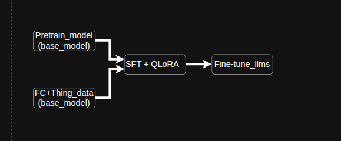

**Chatbot-Q&A-agent**

# 🌟 **Introduction**
This project consists of two main path:

### Fine-tuning Llama 3 and Qwen2.5
Fine-tune Llama 3 and Qwen2.5 language models to improve Function Calling capabilities using the xLAM dataset and QLoRA.

### Chatbot Agent
Develop an intelligent chatbot agent capable of understanding context, retrieving information, and executing tasks through external tools.


### Hardware Requirements:

GPU: 16GB+ VRAM (24GB recommended for larger models)<br>
RAM: 32GB+ system memory<br>
Storage: 50GB+ free space for models and datasets<br>


**Project Structure**
Q&A-agent
```
|agent

|					|tools
|					| 				|----Search.py
|					| 				|----code_Interpreter.py
|					| 				|----Mathenmatical.py
|					| 				|----document_proccesing.py
|					| 				|----image_generation.py
|					|				|----code_multilang.py
|					|				|process  .....                            
|					|rag
|					|					|__init__.py
|					|					|embeding.py					#configure of model and training

|					|					|retriever.py					#create vectortore from data was embedding
|					|llms.py											#select model llms for agent
|					|graph.py											#build agent with format langgraph
|					|prompt_templates.py				

|Fine_tune
|					|Configs
|					|  				|FT_config.py  		        	    #configure of model and training

|					|Scripts
|					|					|__init__.py
|					|					|prepare_data.py		         # create, format -load and process xLam dataset
|					|					|merge_adapter.py			    #configure the tokenizer , Qlora-enable model and Create LoRA for parameter-efficient fine-tuning 
|					|					|setup_.py 						#setup hardware
|					|					|training.py					# Training QLoRA with SFTTrainer
|					|inference
|					|					|model_loading_interface.py 	#load and test model after training
|configs
|					|agent_config
|					||FT_config.py  		        	                #configure of model and training
|data
|					|agent_config
|					|retriever_config
|evaluation
|					|combinedata										#combine data of gaia and paper was gernerate from claude.ai to embedding
|					|gaia_dataset										#download gaia dataset
|app.py
|SFTtrainer.py													
|docker_compose.py
|requirement.txt
|README.md												#we in here
|Dockerfile


```

## FineTune:
### Model fine tune:
 


Scripts will Fine tune Meta-Llama-3-8B-Instruct and Qwen2.5-7B-Instruct to improve Function Calling capabilities using the [xLAM dataset](https://huggingface.co/datasets/Salesforce/xlam-function-calling-60k) and QLoRA.


Model Fine tune of project was save in here: [Model Card for Qwen2_5_7B_Instruct_xLAM](https://huggingface.co/gugukaka/Qwen2.5-7B-Instruct-xLAM) and [Model Card for Meta_Llama_3_8B_Instruct_xLAM](https://huggingface.co/gugukaka/Meta-Llama-3-8B-Instruct-xLAM)

See how to use to Fine tune.
### Agent Chatbot
This system will focus in capabilities required to sole question in [GAIA](https://huggingface.co/spaces/gaia-benchmark/leaderboard), beside the i was use claude.ai to generate several articles on random topics to service for RAG. The chatbot agent is implemented using the LangGraph framework from LangChain, enabling structured workflows and tool-based interactions.

**GAIA Agent** is a sophisticated AI-powered chatbot system designed to handle complex questions and tasks through an intuitive Q&A interface. Built on top of the GAIA benchmark framework, this agent combines advanced reasoning, code execution, web search, document processing, and multimodal understanding capabilities. The system features both a user-friendly chatbot interface and a comprehensive evaluation runner for benchmark testing.


# **Key Features**


# 🔧 **Technical Architecture**

### **LangGraph State Machine**


1. **Retriever Node**: Searches vector database for similar questions
2. **Assistant Node**: LLM processes question with available tools  # using:qwen/qwen3-32b 
3. **Tools Node**: Executes selected tools (web search, code, etc.)
4. **Conditional Routing**: Dynamically routes between assistant and tools


## **Tool Categories**

### **🌐 Browser & Search Tools**
- **Wikipedia Search**: Search Wikipedia with up to 2 results
- **Web Search**: Tavily-powered web search with up to 3 results  
- **arXiv Search**: Academic paper search with up to 3 results

### **💻 Code Interpreter Tools**
- **Multi-Language Execution**: Python, Bash, SQL, C, Java support
- **Plot Generation**: Matplotlib visualization support
- **DataFrame Analysis**: Pandas data processing
- **Error Handling**: Comprehensive error reporting

### **🧮 Mathematical Tools**
- **Basic Operations**: Add, subtract, multiply, divide
- **Advanced Functions**: Modulus, power, square root
- **Complex Numbers**: Support for complex number operations

### **📄 Document Processing Tools**
- **File Operations**: Save, read, and download files
- **CSV Analysis**: Pandas-based data analysis
- **Excel Processing**: Excel file analysis and processing
- **OCR**: Extract text from images using Tesseract

### **🖼️ Image Processing & Generation Tools**
- **Image Analysis**: Size, color, and property analysis
- **Transformations**: Resize, rotate, crop, flip, adjust brightness/contrast
- **Drawing Tools**: Add shapes, text, and annotations
- **Image Generation**: Create gradients, noise patterns, and simple graphics
- **Image Combination**: Stack and combine multiple images


# 🎯 **How to Use**


## ⚙️ **Installation & Setup**


### **1. Clone Repository**
```bash

git clone git@github.com:datt46999/GAIA_Agent.git
cd gaia-agent
```

### 2 Create venv and install dependencies

```bash
uv venv
.venv/bin/activate
uv sync
```

### IF YOU WANT FINE TUNE:
#### option1 run code through Docker file
```bash


# Build image
sudo docker build -t model_sfttrain .

# run with GPU
sudo docker run --gpus all model_sfttrain
```

#### option2 run code through code implement


```bash
pip install -r requirements.txt
python SFTtrainer.py

```

### IF YOU WANT RUN CHATBOT AGENT

### **3. Install Dependencies**
```bash
pip install -r requirements.txt
```

### **3. Environment Variables**

<!-- SUPABASE_URL=https://xxxxxxxxxxxxxxxxxxxxx.supabase.co --> 

Create a `.env` file with your API keys:
```
SUPABASE_URL=your_supabase_url
SUPABASE_SERVICE_ROLE_KEY=your_supabase_key
OPENAI_API_KEY=your_openai_api_key
HF_TOKEN=your_hf_token
TAVILY_API_KEY=your_tavily_api_key


LANGFUSE_SECRET_KEY=your_langfuse_secret_key
LANGFUSE_PUBLIC_KEY=your_langfuse_public_key
LANGFUSE_BASE_URL=https://cloud.langfuse.com # 🇪🇺 EU region
```
### **4. Database Setup (Supabase)**
Execute this SQL in your Supabase database:
```sql
-- ═══════════════════════════════════════════════════════
-- DOCUMENTS 1  "BAAI/bge-m3"
-- ═══════════════════════════════════════════════════════
DROP TABLE IF EXISTS public.documents1;
CREATE TABLE public.documents1 (
  id        uuid PRIMARY KEY DEFAULT gen_random_uuid(),
  content   text,
  metadata  jsonb,
  embedding vector(1024)
);

CREATE OR REPLACE FUNCTION public.match_documents_1(
  query_embedding vector(1024),
  match_count     int DEFAULT 10
)
RETURNS TABLE(
  id         uuid,            
  content    text,
  metadata   jsonb,
  embedding  vector(1024),
  similarity double precision
)
LANGUAGE sql STABLE
AS $$
  SELECT
    id,
    content,
    metadata,
    embedding,
    1 - (embedding <=> query_embedding) AS similarity
  FROM public.documents1
  ORDER BY embedding <=> query_embedding
  LIMIT match_count;
$$;

GRANT EXECUTE ON FUNCTION public.match_documents_1(vector, int) TO anon, authenticated;
ALTER TABLE public.documents1 DISABLE ROW LEVEL SECURITY;

```


## 🚀 **Running the Application**

### **Run**
```bash
python app.py
```
Access at: `http://localhost:7860`

### evaluation 
```bash
python -m evaluaion.eval_benchmark
```


### code Evaluation: [Huggingface](https://huggingface.co/spaces/gugukaka/GAIA_agent) 
## 🔗 **Resources**

- [GAIA Benchmark](https://huggingface.co/spaces/gaia-benchmark/leaderboard)
- [Hugging Face Agents Course](https://huggingface.co/agents-course)
- [LangGraph Documentation](https://langchain-ai.github.io/langgraph/)
- [Supabase Vector Store](https://supabase.com/docs/guides/ai/vector-columns)